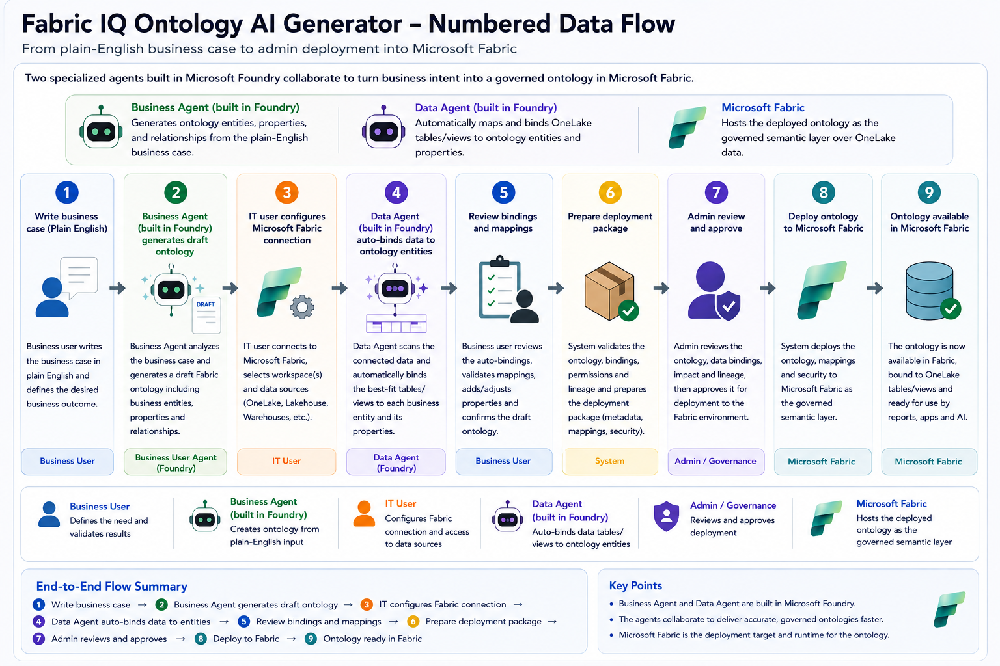
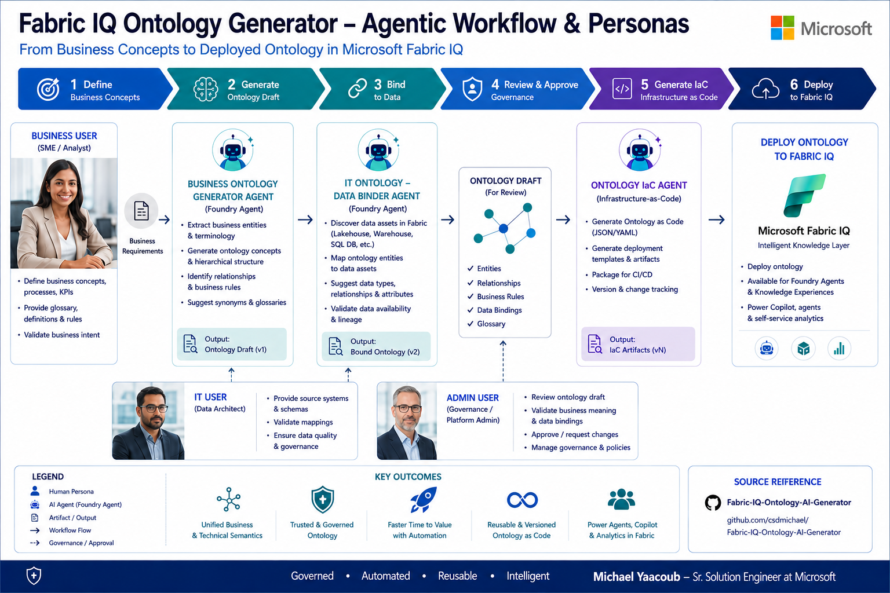

# Fabric IQ Ontology AI Generator

## Table of Contents
- [Overview](#overview)
- [Architecture](#architecture)
- [Agentic Workflow Personas](#agentic-workflow-personas)
- [Deployed Endpoints](#deployed-endpoints)
- [Features](#features)
- [Authentication & Roles](#authentication--roles)
- [Foundry Agents](#foundry-agents)
- [Getting Started](#getting-started)
  - [UI Setup](#ui-setup)
  - [API Setup](#api-setup)
  - [API Documentation (Swagger)](#api-documentation-swagger)
- [Development](#development)
- [Environment Variables](#environment-variables)
- [CI/CD & GitHub Workflows](#cicd--github-workflows)
- [License](#license)

## Overview

Fabric IQ Ontology AI Generator helps business teams describe a business case in plain English and generate a draft ontology with business entities, properties, and relationships before any Fabric connection is required. After business approval, IT teams add Microsoft Fabric Lakehouse bindings, generate ontology deployment artifacts, and submit to admins for Fabric deployment. The scaffold includes an Angular + Ionic frontend, a Node/Express API, placeholder Azure service integrations, and starter tests.

## Architecture



The diagram above shows the end-to-end flow from a business user describing a use case in the UI through to a Fabric-bound, AI-generated ontology. The numbered steps below trace what happens at each tier.

1. **Business user signs in** to the Angular 17 + Ionic 7 UI (`ui-fabriciq-b3.azurewebsites.net`). Authentication goes through Microsoft Entra ID (interactive popup) or an email + one-time code fallback; the UI receives a session token plus the user's role-based permissions.
2. **Business prompt capture (no Fabric required).** The business user enters a plain-English prompt in the UI. No workspace connection is required at this stage.
3. **Ontology generation.** The API calls the Microsoft Foundry **ontology-generator** agent and persists a business draft (entities, properties, relationships) to Cosmos DB.
4. **Graph-based review and editing.** The business user reviews and edits entities, relationships, and properties in the ontology graph/editor, then saves as draft.
5. **Submit draft to IT.** The business user submits the draft for IT data binding (`awaiting_data_binding`).
6. **IT Fabric binding.** IT configures Lakehouse connection and uses the **ontology-data-binder** agent + manual controls to map entity/property fields to Lakehouse tables/views.
7. **Package generation for deployment.** When IT submits the bound ontology, the API generates and stores `ontology.ttl`, `entities.json`, `relationships.json`, and `bindings.json` in Blob Storage.
8. **Admin deployment to Fabric.** Admin triggers deployment from the UI; the API dispatches the Fabric deployment flow using the packaged ontology artifacts.
8. **Observability and CI/CD.** All tiers emit logs/metrics. The repo is built and deployed via GitHub Actions (OIDC → User-Assigned Managed Identity → Azure App Service) with separate `deploy-api` and `deploy-ui` workflows (see [CI/CD & GitHub Workflows](#cicd--github-workflows)).

For the full text-based architecture reference (ASCII diagram + service inventory), see [docs/architecture.md](docs/architecture.md).

## Agentic Workflow Personas



The agentic workflow combines human decision-makers with specialized AI agents. Humans define intent, approve transitions, and own governance. Agents accelerate generation and binding tasks while keeping humans in control of release gates.

### Human personas

| Persona | Primary goal | Main actions in workflow |
| --- | --- | --- |
| Business User | Define domain intent and validate business meaning | Write prompt, review generated entities/relationships, save draft, submit for IT binding |
| IT User | Ground ontology in real Fabric data sources | Bind entities/properties to Lakehouse tables/views, validate mappings, submit deployment package |
| Admin | Operate release and platform governance | Approve and trigger Fabric deployment, monitor deployment outcomes, enforce operational controls |
| App Owner | Manage access and policy boundaries | Configure roles and permissions, onboard users, audit access and workflow ownership |

### Agent personas

| Agent | Responsibility | Trigger point |
| --- | --- | --- |
| `ontology-generator` | Transform business prompt into ontology draft (entities, properties, relationships) | Invoked during Generate flow by Business User |
| `ontology-data-binder` | Propose/assist schema-to-Lakehouse bindings | Invoked during IT binding phase by IT User |

### Human-agent interaction model

1. Business User provides high-level domain context.
2. `ontology-generator` returns a machine-generated draft.
3. Business User edits and validates semantics, then saves/submits.
4. IT User invokes `ontology-data-binder` to accelerate mapping.
5. IT User finalizes bindings and submits a deployment-ready package.
6. Admin approves and deploys to Fabric.

This separation ensures agentic acceleration without removing human accountability at critical workflow checkpoints.

## Deployed Endpoints

| Component | URL |
| --- | --- |
| UI (public) | https://ui-fabriciq-b3.azurewebsites.net |
| API (VNet-integrated, called from UI) | https://api-fabriciq-b3.azurewebsites.net |
| API — Swagger UI | https://api-fabriciq-b3.azurewebsites.net/api/docs |
| API — OpenAPI spec (JSON) | https://api-fabriciq-b3.azurewebsites.net/api/openapi.json |
| API — Health probe | https://api-fabriciq-b3.azurewebsites.net/api/health |

> The API runs in the VNet behind a private endpoint. Swagger UI is reachable from the public UI App Service via VNet integration; direct browser access from the internet is intentionally blocked. To explore the API interactively, sign in to the UI and open the **System Documentation → API Reference** link, or run `npm run start:api` locally and visit http://localhost:3000/api/docs.

## Features

- Angular 17 + Ionic 7 standalone UI with role-aware business and IT workflows
- Graph-first ontology studio for entities, properties, relationships, and Lakehouse bindings
- Business prompt generation flow that does not require Fabric connection
- Node.js + TypeScript API for ontology CRUD, status transitions, and artifact packaging
- Placeholder integrations for Cosmos DB, Blob Storage, Fabric / OneLake, and OpenAI / Azure OpenAI
- Environment-driven configuration for local development and deployment
- Workspace scripts for running UI and API together
- Starter Jasmine/Karma and Jest/Supertest tests

## Getting Started

### Prerequisites

- Node.js 20+
- npm 10+
- A Chromium-based browser for Karma tests

### Azure / GitHub Actions Bootstrap (one-time)

The CI/CD workflows in [.github/workflows](.github/workflows) use **OIDC federation** from GitHub Actions to a User-Assigned Managed Identity (UAMI) in Azure — no client secrets stored in GitHub. The bootstrap below provisions the identity, grants it RBAC, and seeds the repository secrets needed by the workflows.

> Run these once per environment. All `az role assignment create` calls are idempotent — re-running them is safe and is the verification step.

#### Environment values used below

| Variable | Value |
| --- | --- |
| Subscription | `86b37969-9445-49cf-b03f-d8866235171c` |
| Tenant | `b158173c-91f6-4f99-b5e9-aa9bcb463863` |
| Resource group | `ai-myaacoub` (westus2) |
| UAMI name | `gha-fabriciq-ontology-oidc` |
| UAMI clientId | `49a233cd-1eea-40b3-9636-6db6be5c289f` |
| UAMI principalId | `c1f1d487-e149-450c-9847-528ed5401ff3` |
| App Service Plan | `plan-fabriciq-b3` (B3 Linux) |
| API web app | `api-fabriciq-b3` |
| UI web app | `ui-fabriciq-b3` |
| Storage account | `aistoragemyaacoub` |
| Entra SPA app | `fabriciq-ontology-ui-spa-b3` (appId `29d4f0cc-f068-4848-8fe1-9e8841bd77e8`) |
| GitHub repo | `csdmichael/Fabric-IQ-Ontology-AI-Generator` |

Replace these with your own values when forking.

#### 1. Create the resource group + UAMI

```bash
az group create --name ai-myaacoub --location westus2

az identity create \
  --name gha-fabriciq-ontology-oidc \
  --resource-group ai-myaacoub \
  --location westus2

UAMI_CLIENT_ID=$(az identity show -g ai-myaacoub -n gha-fabriciq-ontology-oidc --query clientId -o tsv)
UAMI_PRINCIPAL_ID=$(az identity show -g ai-myaacoub -n gha-fabriciq-ontology-oidc --query principalId -o tsv)
```

#### 2. Federate GitHub Actions → UAMI (OIDC, no secrets)

Three federated credentials so the same UAMI can be used from `main`, pull requests, and the `production` environment:

```bash
REPO="csdmichael/Fabric-IQ-Ontology-AI-Generator"

az identity federated-credential create \
  --identity-name gha-fabriciq-ontology-oidc -g ai-myaacoub \
  --name gh-main \
  --issuer https://token.actions.githubusercontent.com \
  --subject "repo:${REPO}:ref:refs/heads/main" \
  --audiences api://AzureADTokenExchange

az identity federated-credential create \
  --identity-name gha-fabriciq-ontology-oidc -g ai-myaacoub \
  --name gh-pr \
  --issuer https://token.actions.githubusercontent.com \
  --subject "repo:${REPO}:pull_request" \
  --audiences api://AzureADTokenExchange

az identity federated-credential create \
  --identity-name gha-fabriciq-ontology-oidc -g ai-myaacoub \
  --name gh-env-prod \
  --issuer https://token.actions.githubusercontent.com \
  --subject "repo:${REPO}:environment:production" \
  --audiences api://AzureADTokenExchange
```

#### 3. Grant RBAC to the UAMI (required for deploys)

The two role assignments below are the **minimum** set for the currently-active workflows (`deploy-api`, `deploy-ui`). Both are idempotent — re-run any time to verify.

```bash
SUB=86b37969-9445-49cf-b03f-d8866235171c
RG=ai-myaacoub
STORAGE=aistoragemyaacoub

# Contributor on the resource group — covers Microsoft.Web/* for app/zipdeploy
az role assignment create \
  --assignee-object-id "$UAMI_PRINCIPAL_ID" \
  --assignee-principal-type ServicePrincipal \
  --role "Contributor" \
  --scope "/subscriptions/${SUB}/resourceGroups/${RG}"

# Storage Blob Data Owner — required for blob uploads/SAS issuance by the API
az role assignment create \
  --assignee-object-id "$UAMI_PRINCIPAL_ID" \
  --assignee-principal-type ServicePrincipal \
  --role "Storage Blob Data Owner" \
  --scope "/subscriptions/${SUB}/resourceGroups/${RG}/providers/Microsoft.Storage/storageAccounts/${STORAGE}"

# Verify
az role assignment list --assignee "$UAMI_PRINCIPAL_ID" --all -o table
```

Expected output (2 rows):

```
Principal                             Role                     Scope
------------------------------------  -----------------------  ---------------------------------------------------------------------------
49a233cd-1eea-40b3-9636-6db6be5c289f  Contributor              /subscriptions/.../resourceGroups/ai-myaacoub
49a233cd-1eea-40b3-9636-6db6be5c289f  Storage Blob Data Owner  /subscriptions/.../resourceGroups/ai-myaacoub/providers/.../aistoragemyaacoub
```

> When you enable the deferred workflows (`deploy-foundry-agents`, `deploy-data-stores`, `deploy-fabric-ontology`, `deploy-infra`), add the corresponding least-privilege roles — typically `Azure AI Developer` (Foundry), `Cosmos DB Built-in Data Contributor` (data stores), and `Key Vault Secrets User` (KV access).

#### 4. Seed GitHub repository secrets

```bash
gh secret set AZURE_CLIENT_ID       -R "$REPO" -b "$UAMI_CLIENT_ID"
gh secret set AZURE_TENANT_ID       -R "$REPO" -b "b158173c-91f6-4f99-b5e9-aa9bcb463863"
gh secret set AZURE_SUBSCRIPTION_ID -R "$REPO" -b "86b37969-9445-49cf-b03f-d8866235171c"
gh secret set ENTRA_CLIENT_ID       -R "$REPO" -b "29d4f0cc-f068-4848-8fe1-9e8841bd77e8"
gh secret set FOUNDRY_PROJECT_ENDPOINT -R "$REPO" -b "<your-foundry-endpoint>"
gh secret set FABRIC_WORKSPACE_ID   -R "$REPO" -b "<your-fabric-workspace-id>"
```

> `KEY_VAULT_NAME` and `TF_STATE_*` are required only when the Key Vault + Terraform workflows are activated; leave them unset until then.

### UI Setup

```bash
npm install
npm run start:ui
```

The UI runs with Angular CLI and expects the API at `http://localhost:3000` by default.

### API Setup

```bash
cp api/.env.example api/.env
npm install
npm run start:api
```

The API runs on port `3000` by default.

### API Documentation (Swagger)

The API ships with a built-in OpenAPI 3.0 spec and Swagger UI for interactive exploration:

| Endpoint | Description |
| --- | --- |
| `GET /api/docs` | Swagger UI (interactive — supports Bearer JWT) |
| `GET /api/openapi.json` | Raw OpenAPI 3.0 spec (machine-readable) |
| `GET /api/health` | Liveness probe |

To explore locally:

1. `npm run start:api`
2. Open http://localhost:3000/api/docs
3. Click **Authorize**, paste a JWT obtained from `POST /api/auth/otp/verify` or `POST /api/auth/entra/login`, then "Try it out" on any secured endpoint.

The Swagger spec covers Auth, Users, Ontologies (incl. workflow transitions), Datasources, Generate, and Foundry Agents.

## Authentication & Roles

The API enforces JWT-based authentication. Two sign-in methods are supported:

- **Microsoft Entra ID** — for `@MngEnvMCAP829495.onmicrosoft.com` accounts. The UI uses MSAL to obtain an `id_token` and exchanges it via `POST /api/auth/entra/login`.
- **One-time passcode (OTP)** — for external accounts (e.g. `myaacoub@microsoft.com`). The flow is `POST /api/auth/otp/request` → email delivered via Azure Communication Services → `POST /api/auth/otp/verify`.

Roles (enforced per-route via `requirePermission`):

| Role | Permissions |
| --- | --- |
| Business User | Prompt and edit ontology drafts (entities/properties/relationships), save draft, submit to IT |
| IT User | Configure Fabric lakehouse connection, bind entities/properties to tables/views, submit packaged ontology |
| Admin | All business + IT permissions; deploy packaged ontology artifacts to Fabric |
| App Owner | All Admin permissions; manage users (create/edit/remove + set auth method) |

Seed App Owners:

- `admin@MngEnvMCAP829495.onmicrosoft.com` (Entra)
- `myaacoub@MngEnvMCAP829495.onmicrosoft.com` (Entra)
- `myaacoub@microsoft.com` (OTP)

## Foundry Agents

Two Microsoft Foundry agents are wired into the UI side-menu:

| Agent | Used by | UI surface |
| --- | --- | --- |
| `ontology-generator` | Business User | Business Ontology Builder → Generate / Editor |
| `ontology-data-binder` | IT User | IT Ontology Data Integration → Editor |

Agent IDs are written to Key Vault (`FOUNDRY-AGENT-ONTOLOGY-GENERATOR-ID`, `FOUNDRY-AGENT-ONTOLOGY-DATA-BINDER-ID`) by the `deploy-foundry-agents` workflow and surfaced to the API at runtime.

## Development

Run both apps together from the repository root:

```bash
npm install
npm start
```

Other useful commands:

```bash
npm run build
npm run test
```

## Environment Variables

Copy `api/.env.example` to `api/.env` and supply values for your environment.

| Variable | Description |
| --- | --- |
| `PORT` | API port |
| `NODE_ENV` | Runtime environment |
| `COSMOS_ENDPOINT` | Azure Cosmos DB endpoint |
| `COSMOS_KEY` | Azure Cosmos DB key |
| `COSMOS_DATABASE` | Cosmos database name |
| `COSMOS_CONTAINER` | Cosmos container name |
| `AZURE_STORAGE_CONNECTION_STRING` | Azure Blob Storage connection string |
| `AZURE_STORAGE_CONTAINER` | Blob storage container name |
| `FABRIC_WORKSPACE_ID` | Microsoft Fabric workspace ID |
| `FABRIC_CAPACITY_ID` | Microsoft Fabric capacity ID |
| `FABRIC_CLIENT_ID` | Fabric app registration client ID |
| `FABRIC_CLIENT_SECRET` | Fabric app registration client secret |
| `FABRIC_TENANT_ID` | Azure tenant ID |
| `OPENAI_API_KEY` | OpenAI API key |
| `AZURE_OPENAI_ENDPOINT` | Azure OpenAI endpoint |
| `AZURE_OPENAI_KEY` | Azure OpenAI key |
| `AZURE_OPENAI_DEPLOYMENT` | Azure OpenAI deployment name |
| `CORS_ORIGIN` | Allowed CORS origin(s) |

## CI/CD & GitHub Workflows

GitHub Actions deploy each component on a path-scoped trigger so unrelated changes never re-deploy. See [.github/workflows/README.md](.github/workflows/README.md) for the full trigger matrix and the list of required secrets.

| Workflow | Triggers on changes to |
| --- | --- |
| `deploy-infra` | `infra/terraform/**` |
| `deploy-api` | `api/**` |
| `deploy-ui` | `ui/**` |
| `deploy-foundry-agents` | `foundry/**` |
| `deploy-fabric-ontology` | `fabric/**` or `repository_dispatch: deploy-ontology` (fired by UI/API) |
| `deploy-data-stores` | `data-stores/**` |

Documentation-only edits (`README.md`, `docs/**`, `LICENSE`) never trigger a workflow.

## License

This project is licensed under the [MIT License](LICENSE).
